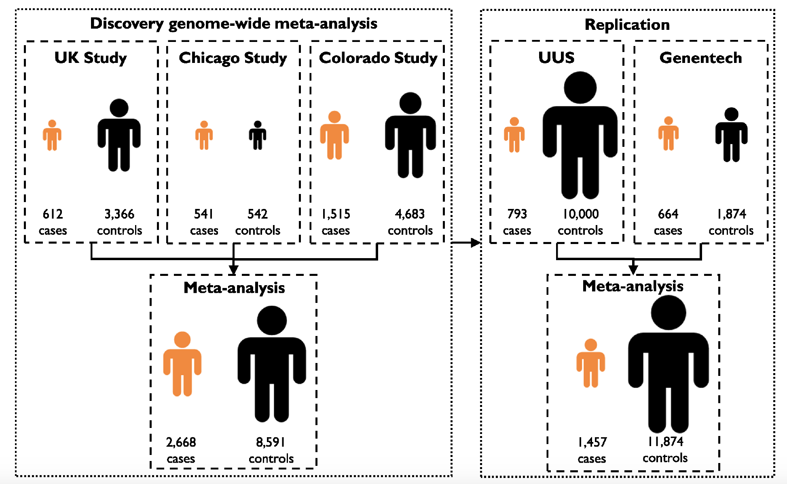
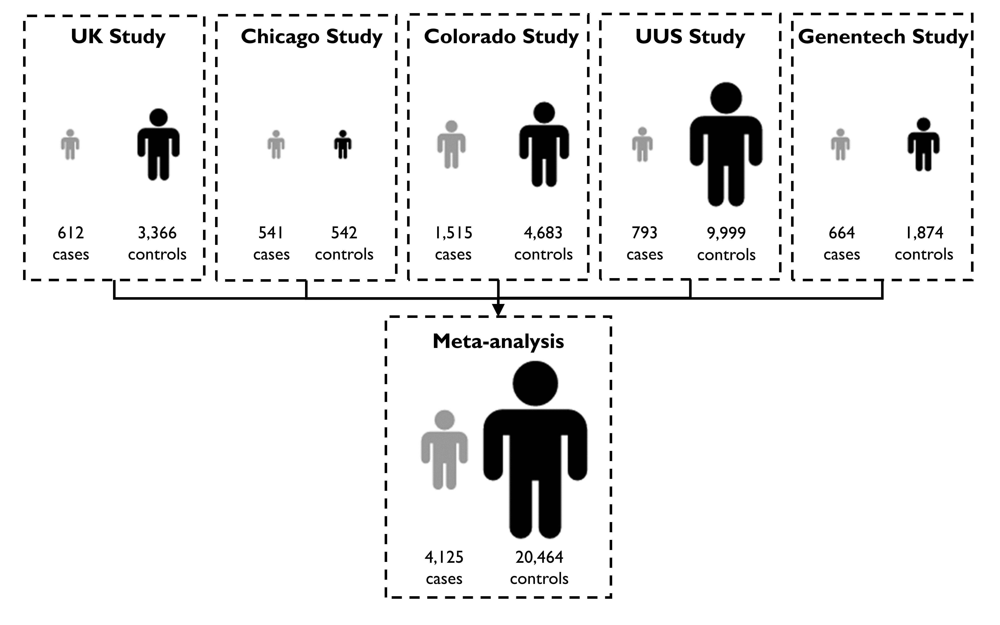
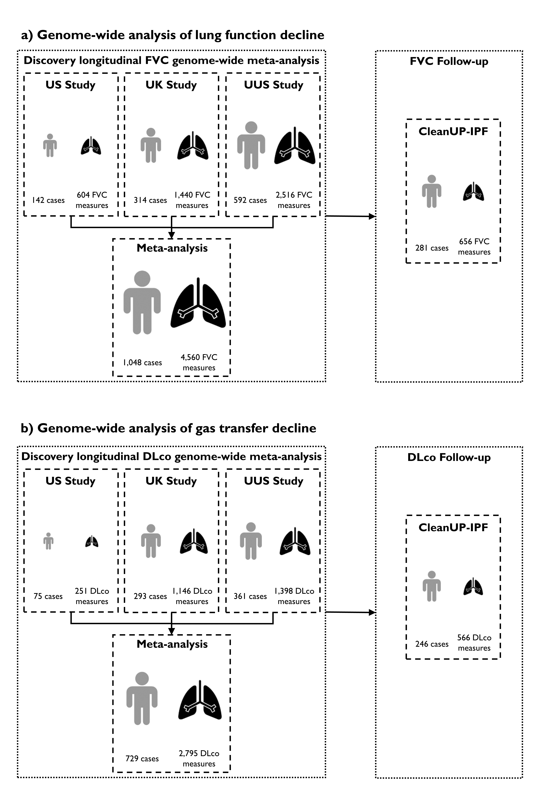
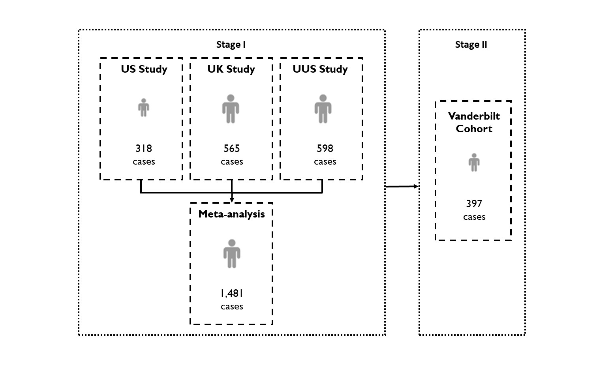

<!-- Last updated: January 24, 2024 -->

# Collaborative genetic studies of idiopathic pulmonary fibrosis
Idiopathic pulmonary fibrosis (IPF) is characterized by the build-up of scar tissue in the lungs. It is believed that the damage to the alveolar epithelium is followed by an aberrant wound healing response leading to the deposition of dense fibrotic tissue, reducing the lungs’ flexibility and inhibiting gas transfer. IPF still has limited therapeutic interventions and a high mortality rate within 3-5 years from diagnosis.

To date, genome-wide association studies (GWAS) of IPF susceptibility have associated common variants (minor allele frequency [MAF]>5%) near genes involved in host defence, telomere maintenance, cell-cell adhesion and signalling in disease susceptibility. Common variants near MUC5B and TOLLIP genes also show association with survival time after diagnosis of IPF (1,2).

<!-- --------------------------------- SECTION -------------------------------- -->

# Publicly available datasets

<ul>
  <li><a href="#study1">3-way meta-GWAS of IPF susceptibility (2020)</a></li>
  <li><a href="#study2">5-way meta-GWAS of IPF susceptibility (2021)</a></li>
  <li><a href="#study3">GWAS of longitudinal lung function and gas transfer in individuals with IPF (2022)</a></li>
  <li><a href="#study4">GWAS of IPF of transplant-free survival (2022)</a></li>
  <li><a href="#study5">Genome-wide SNP-sex interaction analysis of susceptibility to IPF (2024)</a></li>
  <li><a href="#study6">7-way meta-GWAS of IPF susceptibility imputed with TopMed (2025)</a></li> 
 </ul>

<!-- --------------------------------- SECTION -------------------------------- -->

# 3-way meta-GWAS of IPF susceptibility (2020)
Building up on published GWAS results (1,3,4) and novel study samples, we have performed a large GWAS of IPF susceptibility (5) to identify novel genes and further advance in the understanding of IPF pathogenesis and risk. The discovery stage of the study comprised up to 2,668 IPF cases and 8,591 controls and replication was pursued in an additional 1,456 IPF cases and 11,874 controls.

  

 

<!--  -->

**Sample sizes for genome-wide analyses**

## Access to the results of this study
To help advance IPF research and allow the wider research community to access to the most accurate effect sizes for genetic variants on a genome-wide scale, the variant summary data from the discovery stage of the study by Allen et al. (5; https://doi.org/10.1164/rccm.201905-1017OC) (1.31 Gb) can be accessed after an internal assessment of formal requests received.

## What type of results would be made available?
No individual level data will be made available. Granted requests will have access to a file with the GWAS meta-analysis variant summary data with information for the following descriptors:

   •	**rsid**
   
   •	**chromosome_position**
      [According to GRCh37/hg19 reference]
      
   •	**non_effect_allele**
   
   •	**effect_allele**
   
   •	**effect_allele_frequency**
      [Frequency taken from across all three studies included in the meta-analysis]
      
   •	**studies_included**
      [This is a piece of text that is Y if it is in the study and N if it is not. For example if the variant was in all three       studies it would read Y:Y:Y (with UK first, Chicago second and Colorado last), if it was in the UK and Chicago but not         included in Colorado it would read Y:Y:N]
      
   •	**imputation_quality_by_study**
      [The imputation r2 by study in the same order as the studies_included column]
      
   •	**effect_direction_by_study**
      [A piece of text with a plus sign (+) if the effect allele was associated with an increased risk of IPF (i.e. beta > 0)         and a minus sign (–) if associated with a decreased risk of IPF (i.e. beta < 0) by study. For example if the effect           allele had lower risk in the UK study but higher risk in the Chicago and Colorado studies it would read -:+:+]
      
   •	**beta**
      [This is the beta from the meta-analysis]
      
   •	**standard_error**
      [This is the standard error from the meta-analysis]
      
   •	**p**
      [This is the p value from the meta-analysis]

  

 
 

<!-- --------------------------------- SECTION -------------------------------- -->

# 5-way meta-GWAS of IPF susceptibility (2021)
To maximise power and to generate more accurate effect size estimates, we performed a genome-wide meta-analysis across all five studies included in the previous IPF risk GWAS (6). We utilised the distribution of effect sizes across the five studies to assess the replicability of the results and identified five robust novel genetic association signals. A total of 4,125 IPF cases, 20,464 controls, and 7,554,248 genetic variants were included in the analysis.

  

 

<!--  -->

**Sample sizes for genome-wide analyses**

## Access to the results of this study
To help advance IPF research and allow the wider research community to access to the most accurate effect sizes for genetic variants on a genome-wide scale, the variant summary data resulting from this second meta-analysis by Allen et al. (6; https://doi.org/10.1101/2021.12.06.21266509) (roughly 0.8 Gb) can be accessed after an internal assessment of formal requests received.

## What type of results would be made available?
No individual level data will be made available. Granted requests will have access to a file with the GWAS meta-analysis variant summary data with information for the following descriptors:

   •	**chromosome_position**
      [According to GRCh37/hg19 reference]
   
   •	**rsid**
      
   •	**non_effect_allele**
   
   •	**effect_allele**
   
   •	**maf**
      [Minor allele frequency taken from across all five studies included in the meta-analysis]
      
   •	**Studies**
      [Number of studies contributing to the result]
      
   •	**n**
      [This is the sample size. Note, as not all variants were included in all studies, this value varies by SNP]
      
   •	**Direction**
      [Effect direction by study. A piece of text with a plus sign (+) if the effect allele was associated with an increased risk of IPF (i.e. beta > 0) and a minus sign (–) if associated with a decreased risk of IPF (i.e. beta < 0) by study (in the order UK, Colorado, Chicago, UUS and then Genentech). If the variant was not included in the analysis, this is recorded with a question mark (?)]
      
   •	**beta**
      [This is the beta from the meta-analysis]
      
   •	**standard_error**
      [This is the standard error from the meta-analysis]
      
   •	**p**
      [This is the p value from the meta-analysis]

  

 
 

<!-- --------------------------------- SECTION -------------------------------- -->

## GWAS of longitudinal lung function and gas transfer in individuals with IPF (2022)
To identify genetic variants associated with progressive forms of IPF, we performed a GWAS of longitudinal measures of FVC and DLco to identify variants that lead to a more rapid decline in lung capacity or gas transfer after a diagnosis of IPF (7; https://doi.org/10.1016/S2213-2600(22)00251-X). The discovery stage was performed over three studies (US, UK and UUS). The FVC analysis comprised up to 1,048 IPF cases who had a total of 4,560 FVC measures recorded and the discovery stage of the DLco analysis comprised of 729 cases with a total of 2,795 DLco measures recorded. Follow-up analyses were performed in an independent dataset (the CleanUP-IPF study).

  

 

<!--  -->

**Sample sizes for genome-wide analyses**

## Access to the results of this study
To help advance IPF research and allow the wider research community to access to the most accurate effect sizes for genetic variants on a genome-wide scale, the variant summary data from the discovery stage of the study by Allen et al. (7; https://doi.org/10.1016/S2213-2600(22)00251-X) (470Mb each) can be accessed after an internal assessment of formal requests received.
 
## What type of results would be made available?
No individual level data will be made available. Granted requests will have access to both the longitudinal FVC and longitudinal DLco analyses in files with the following descriptors:

   •	**chromosome**
   
   •	**position**
   [According to GRCh37/hg19 reference]
   
   •	**rsid**
   
   •	**non_effect_allele**
   
   •	**effect_allele**
   
   •	**eaf**
   [Effect Allele Frequency from across all three studies included in the meta-analysis]
   
   •	**n_studies**
   [The number of studies the variant was analysed in the meta-analysis]
   
   •	**n_individuals**
   [The number of individuals the variant was analysed in the meta-analysis]
   
   •	**n_fvc_measures or n_dlco_measures**
   [The total number of FVC or DLco measures the variant was analysed on the meta-analysis]
   
   •	**beta**
   [This is the beta from the meta-analysis. For the FVC analysis the effect size is in terms of change in FVC in ml/year and for the DLco analysis the effect size is in terms of a change of mmol/min/kPa/year]
   
   •	**standard_error**
   [This is the standard error from the meta-analysis]
   
   •	**p**
   [This is the p value from the meta-analysis]

  

 
 

<!-- --------------------------------- SECTION -------------------------------- -->

## GWAS of IPF of transplant-free survival (2022)
A few IPF susceptibility-associated variants have been shown to predict IPF outcomes, suggesting that genomic determinants of IPF susceptibility and survival may have limited overlap. We have performed the first GWAS of IPF survival (8; https://doi.org/10.1101/2022.05.06.22274705) using paired genomic and outcome data from previous studies and novel IPF cases with whole-genome sequencing data from Vanderbilt University. The stage I of the study comprised 1,481 IPF cases assessed at genome-wide scale (UK, US, and UUS studies). Prioritized variants in stage I were then tested in additional 397 IPF cases in stage II, followed by meta-analysis.

  

 

<!--  -->

**Sample sizes for genome-wide analyses**

## Access to the results of this study
To help advance IPF research and allow the wider research community to access to the most accurate effect sizes for genetic variants on a genome-wide scale, the variant summary data resulting from the stage I of the GWAS of survival (8; https://doi.org/10.1101/2022.05.06.22274705) (585 Mb) can be accessed after an internal assessment of formal requests received.

## What type of results would be made available?
No individual level data will be made available. Granted requests will have access to a file with the GWAS variant summary data with information for the following descriptors:

   •	**CHR** 

   •	**POS** 
[Position according to GRCh37/hg19 reference]

   •	**rsid** 
[Marker name (CHR:POS)]

   •	**EA**
[Effect allele]

   •	**NEA** 
[Non effect allele]

   •	**EAF**
[Effect allele frequency taken from across all three studies included in the stage I]

   •	**Effect** 
[This is the beta from the meta-analysis]

   •	**StdErr**
[This is the standard error from the meta-analysis]

   •	**P-value**
[This is the p value from the meta-analysis]

### Note:

See logs section <a href="#Update logs">[1]</a> for recent changes (January 2024) in the shared data for this study.

 

  

 
 

<!-- --------------------------------- SECTION -------------------------------- -->

## Genome-wide SNP-sex interaction analysis of susceptibility to IPF (2024)
To identify genetic variants whose effects on IPF susceptibility are different in males and females, we performed a genome-wide meta-analysis across six IPF studies (9; https://doi.org/10.1101/2024.01.12.24301204). We utilised the distribution of effect sizes across the six studies to assess the replicability of the results and identified three suggestively significant (<i>P</i><1x10-6) genetic association signals. A total of 4,561 cases (comprising 1,280 females and 2,281 males) and 22,888 controls (8,360 females and 14,528 males) were included in the analysis. We analysed a total of 8,485,642 genetic variants. We sought validation of male-specific effect sizes and direction in a male-only IPF case control study, IPFJES (IPF Job Exposure Study), comprising 416 male IPF cases and 2,465 male controls

  

 

<!--  -->

## Access to the results of this study
To help advance IPF research and allow the wider research community to access to the most accurate effect sizes for genetic variants on a genome-wide scale, the variant summary data resulting from this genome-wide SNP-sex interaction analysis of susceptibility to IPF by Leavy et al. (9; https://doi.org/10.1101/2024.01.12.24301204) (approximately 800 MB) can be accessed after an internal assessment of formal requests received.

## What type of results would be made available?
No individual level data will be made available. Granted requests will have access to a file with the GWAS meta-analysis variant summary data with the following descriptors:

   •	**chromosome** 

   •	**position** 
[Position according to GRCh38 reference]

   •	**rsid** 
rsid [Marker name (chromosome:position) build38]

   •	**non_effect_allele**

   •	**effect_allele** 

   •	**eaf**
[Effect Allele Frequency from across five of the six studies included in the meta-analysis (UK, US, Colorado, UUS and CleanUP-UCD)]. Please note, some of the allele frequencies are less than 1%, this is because they are based on a sub-sample of all samples used for TopMed imputation and samples analysed. 

   •	**n_studies** 
[The number of studies the variant was analysed in the meta-analysis]

   •	**beta**
[This is the beta from the meta-analysis]

   •	**standard_error**
[This is the standard error from the meta-analysis]

   •	**p**
[This is the p value from the meta-analysis]

  

 
 

<!-- --------------------------------- SECTION -------------------------------- -->

## 7-way meta-GWAS of IPF susceptibility imputed with TopMed (2025)
To identify additional genes involved in the pathogenesis of IPF that could provide new pathobiological avenues of investigation and guide future drug target discovery, we performed a genome-wide meta-analysis of all seven studies using clinically curated European ancestry datasets with dense genomic coverage (https://doi.org/10.1101/2025.01.30.25321017). This study compromise 5,159 IPF cases and 27,459 controls. Genotypes were obtained from Whole Genome Sequencing (WGS) or from array-based imputation to the TOPMed WGS reference panel.

  

 

<!--  -->

## Access to the results of this study
To help advance IPF research and allow the wider research community to access to the most accurate effect sizes for genetic variants on a genome-wide scale, the variant summary data resulting from this 7-way meta-GWAS of susceptibility to IPF (https://doi.org/10.1101/2025.01.30.25321017) (approximately 1.96 GB) can be accessed after an internal assessment of formal requests received.

## What type of results would be made available?
No individual level data will be made available. Granted requests will have access to a file with the GWAS meta-analysis variant summary data with the following descriptors:

   •	**chromosome** [build38]

   •	**position** [build38]

   •	**rsid** [Marker name (chromosome:position) build38]

   •	**non_effect_allele**

   •	**effect_allele**

   •	**eaf** [Effect Allele Frequency average from across seven studies included in the meta-analysis].
    <i>Please note that some of the allele frequencies are less than 1% because they are based on a sub-sample of all samples used for TopMed imputation and samples analysed. In this study, we filtered SNPs based on minor allele account (MAC) ≤ 3 for each individual study, not by MAF. See the manuscript for further details</i>.

   •	**n_studies** [The number of studies the variant was analysed in the meta-analysis]

   •	**beta** [This is the beta from the meta-analysis]

   •	**standard_error** [This is the standard error from the meta-analysis]

   •	**p** [This is the p value from the meta-analysis]

  

 
 

<!-- --------------------------------- SECTION -------------------------------- -->

## Who should I contact for requesting access to the data?
Requesters should contact **`GWASIPF[dot]adm[at]gmail.com`** for requesting access to the data. Designated delegates of this collaborative effort will review the requests. Within a few days, an email with the instructions for data downloading will be obtained in response.

Please, be aware that **delays in obtaining a response** with the instructions for downloading are expected during particular periods of the year.

## Which information should I submit to access the variant summary data?
Requesters should provide a signed document including the following information: full name and title of the PI, affiliation, and a brief description of the project and the aims where the data is to be used. 

The document should explicitly state that the data requester also agrees to: use the data only as part of that indicated research, not redistribute the data outside the project without permission, acknowledge the provenance of the data in any dissemination of results.

A template document for the request is [here](https://github.com/genomicsITER/PFgenetics/blob/master/Request_template.txt).

  

 
 

<!-- --------------------------------- SECTION -------------------------------- -->

## Collaborative group
Dr. Carlos Flores, Research Unit - Hospital Universitario N.S. de Candelaria & Genomics Division – Instituto Tecnológico y de Energías Renovables (ITER), Spain.

Dr. R. Gisli Jenkins, National Institute for Health Research, Nottingham Biomedical Research Centre, Nottingham University Hospitals & Division of Respiratory Medicine – University of Nottingham, UK.

Dr. Imre Noth, Division of Pulmonary & Critical Care Medicine, University of Virginia, USA.

Dr. Justin M. Oldham, Department of Internal Medicine, University of California Davis, USA.

Dr. Louise V. Wain, Department of Health Sciences - University of Leicester & Leicester Respiratory Biomedical Research Centre - Glenfield Hospital, UK.

  

 
 

<!-- --------------------------------- SECTION -------------------------------- -->

## References
1: Noth I, Zhang Y, Ma SF, Flores C, Barber M, Huang Y, Broderick SM, Wade MS, Hysi P, Scuirba J, Richards TJ, Juan-Guardela BM, Vij R, Han MK, Martinez FJ, Kossen K, Seiwert SD, Christie JD, Nicolae D, Kaminski N, Garcia JGN. Genetic variants associated with idiopathic pulmonary fibrosis susceptibility and mortality: a genome-wide association study. Lancet Respir Med 2013, 1: 309-317. doi: https://doi.org/10.1016/S2213-2600(13)70045-6. PubMed PMID: 24429156.

2: Peljto AL, Zhang Y, Fingerlin TE, Ma SF, Garcia JG, Richards TJ, Silveira LJ, Lindell KO, Steele MP, Loyd JE, Gibson KF, Seibold MA, Brown KK, Talbert JL, Markin C, Kossen K, Seiwert SD, Murphy E, Noth I, Schwarz MI, Kaminski N, Schwartz DA. Association between the MUC5B promoter polymorphism and survival in patients with idiopathic pulmonary fibrosis. JAMA 2013, 309: 2232-9. doi: https://doi.org/10.1001/jama.2013.5827. PubMed PMID: 23695349.

3: Fingerlin TE, Murphy E, Zhang W, Peljto AL, Brown KK, Steele MP, Loyd JE, Cosgrove GP, Lynch D, Groshong S, Collard HR, Wolters PJ, Bradford WZ, Kossen K, Seiwert SD, du Bois RM, Garcia CK, Devine MS, Gudmundsson G, Isaksson HJ, Kaminski N, Zhang Y, Gibson KF, Lancaster LH, Cogan JD, Mason WR, Maher TM, Molyneaux PL, Wells AU, Moffatt MF, Selman M, Pardo A, Kim DS, Crapo JD, Make BJ, Regan EA, Walek DS, Daniel JJ, Kamatani Y, Zelenika D, Smith K, McKean D, Pedersen BS, Talbert J, Kidd RN, Markin CR, Beckman KB, Lathrop M, Schwarz MI, Schwartz DA. Genome-wide association study identifies multiple susceptibility loci for pulmonary fibrosis. Nat Genet 2013, 45: 613-20. doi: https://doi.org/10.1038/ng.2609. PubMed PMID: 23583980.

4: Allen RJ, Porte J, Braybrooke R, Flores C, Fingerlin TE, Oldham JM, Guillen-Guio B, Ma SF, Okamoto T, John AE, Obeidat M, Yang IV, Henry A, Hubbard RB, Navaratnam V, Saini G, Thompson N, Booth HL, Hart SP, Hill MR, Hirani N, Maher TM, McAnulty RJ, Millar AB, Molyneaux PL, Parfrey H, Rassl DM, Whyte MKB, Fahy WA, Marshall RP, Oballa E, Bossé Y, Nickle DC, Sin DD, Timens W, Shrine N, Sayers I, Hall IP, Noth I, Schwartz DA, Tobin MD, Wain LV, Jenkins RG. Genetic variants associated with susceptibility to idiopathic pulmonary fibrosis in people of European ancestry: a genome-wide association study. Lancet Respir Med 2017, 5: 869-880. doi: https://doi.org/10.1016/S2213-2600(17)30387-9. PubMed PMID: 29066090.

5: Allen RJ,  Guillen-Guio B,  Oldham JM,  Ma SF,  Dressen A,  Paynton ML,  Kraven L,  Obeidat M,  Li X,  Ng M,  Braybrooke R, Molina-Molina M, Hobbs BD,  Putman RK,  Sakornsakolpat P,  Booth HL,  Fahy WA, Hart SP, Hill MR,  Hirani N,  Hubbard RB,  McAnulty RJ, Millar AB, Navaratnam V, Oballa E, Parfrey H, Saini G, Whyte MKB, Zhang Y, Kaminski N, Adengunsoye A, Sterk ME, Neighbors M, Sheng XR, Gudmundsson G, Gudnason V, Hatabu H, Lederer DJ, Manichaikul A, Newell Jr JD, O'Connor GT, Ortega VE, Xu H, Fingerlin TE, Bossé Y, Hao K, Joubert P, Nickle DC, Sin DD, Timens W, Furniss D, Morris AP, Zondervan K, Hall IP, Sayers I, Tobin MD, Maher TM, Cho MH, Hunninghake GM, Schwartz DA, Yaspan BL, Molyneaux PL, Flores C, Noth I, Jenkins RG, Wain LV. Genome-wide association study of susceptibility to idiopathic pulmonary fibrosis. Am J Respir Crit Care Med 2020, 201: 564-574. doi: https://doi.org/10.1164/rccm.201905-1017OC. PubMed PMID: 31710517.

6: Allen RJ, Stockwell A, Oldham JM, Guillen-Guio B, Schwartz DA, Maher TM, Flores C, Noth I, Yaspan BL, Jenkins RG, Wain LV, International IPF Genetics Consortium. Genome-wide association study across five cohorts identifies five novel loci associated with idiopathic pulmonary fibrosis. Thorax 2022, 77: 829-833. doi: https://doi.org/10.1136/thoraxjnl-2021-218577. PubMed PMID: 35688625.

7: Allen RJ, Oldham JM, Jenkins DA, Leavy QC, Guillen-Guio B, Melbourne CA, Ma SF, Jou J, Kim JS, CleanUP-IPF Investigators of the Pulmonary Trials Cooperative, Fahy WA, Oballa E, Hubbard RB, Navaratnam V, Braybrooke R, Saini G, Roach KM, Tobin MD, Hirani N, Whyte MKB, Kaminski N, Zhang Y, Martinez FJ, Linderholm AL, Adegunsoye A, Strek ME, Maher TM, Molyneaux PL, Flores C, Noth I, Jenkins RG, Wain LV. Genome-wide analysis of longitudinal lung function and gas transfer in individuals with idiopathic pulmonary fibrosis. Lancet Respir Med 2023, 11: 65-73. doi: https://doi.org/10.1016/S2213-2600(22)00251-X. PubMed PMID: 35985358.

8: Oldham JM, Allen RJ, Lorenzo-Salazar JM, Molyneaux PL, Ma SF, Joseph C, Kim JS, Guillen-Guio B, Hernández-Beeftink T, Kropski J, Huang Y, Lee CT, Adegunsoy A, Pugashetti JV, Linderholm A, Vo V, Strek M, Jou J, Muñoz-Barrera A, Rubio-Rodriguez LA, Hubbard R, Hirani N, Whyte MKB, Hart S, Nicholson A, Lancaster L, Parfrey H, Rassl D, Wallace W, Valenzi E, Zhang Y, Mychaleckyj J, Stockwell A, Kaminski N, Wolters P, Molina-Molina M, Fahy WA, Martinez FJ, Hall I, Tobin MD, Maher TM, Blackwell T, Yaspan B, Jenkins RG, Flores C, Wain LV, Noth I. PCSK6 and Survival in Idiopathic Pulmonary Fibrosis. Am J Respir Crit Care Med 2023, 207: 1515–1524. doi: https://doi.org/10.1164/rccm.202205-0845OC. PubMed PMID: 36780644.

9: Leavy OC, Goemans AF, Stockwell AD, Allen RJ, Guillen-Guio B, Hernandez-Beeftink T, Adegunsoye A, Booth HL, CleanUP-IPF Investigators of the Pulmonary Trials Cooperative, Cullinan P, Fahy WA, Fingerlin TE, Virk HS, Hall IP, Hart SP, Hill MR, Hirani N, Hubbard RB, Kaminski N, Ma SF, McAnulty RJ, Sheng XR, Millar AB, Molina-Molina M, Navaratnam V, Neighbors M, Parfrey H, Saini G, Sayers I, Strek ME, Tobin MD, Whyte MKB, Zhang Y, Maher TM, Molyneaux PL, Oldham JM, Yaspan BL, Flores C, Martinez F, Reynolds CJ, Schwartz DA, Noth I, Jenkins RG, Wain LV. Genome-wide SNP-sex interaction analysis of susceptibility to idiopathic pulmonary fibrosis. medRxiv 2024.01.12.24301204; doi: https://doi.org/10.1101/2024.01.12.24301204.

10: Chin D, Hernandez-Beeftink T, Donoghue L, Guillen-Guio B, Leavy OC, Adegunsoye A, Booth HL, CleanUP-IPF Investigators of the Pulmonary Trials Cooperative, Fahy WA, Fingerlin TE, Gooptu B, Hall IP, Hart SP, Hill MR, Hirani N, Hubbard RB, Johnson S, Kaminski N, Lorenzo-Salazar JM, Ma SF, McAnulty RJ, McCarthy M, Stockwell AD, Maher TM, Millar AB, Molyneaux PL, Molina-Molina M, Navaratnam V, Neighbors M, Oldham JM, Parfrey H, Saini G, Sayers I, Sheng XR, Stewart ID, Strek ME,
Tobin MD, Whyte MKB, Zarcone MC, Zhang Y, Martinez F, Yaspan BL, Reynolds CJ, Schwartz DA, Flores C, Noth I, Jenkins, RG, Allen RJ, Wain LW. Genome-wide association study of Idiopathic Pulmonary Fibrosis susceptibility using clinically-curated European-ancestry datasets. medRxiv 2025.01.30.25321017. doi: https://doi.org/10.1101/2025.01.30.25321017.

 
 

<!-- --------------------------------- SECTION -------------------------------- -->

## Update logs

> [1] January 30, 2024. Revised version of the GWAS of IPF of transplant-free survival (2022) data file after some issues were reported by end-users: <i>'Effect'</i> and <i>'Non effect'</i> alleles (instead of <i>'REF'</i> and <i>'ALT'</i> alleles) has been included; missing <i>'EAF'</i> values are now included, and issues with <i>'Effect'</i> are also fixed. 

  

